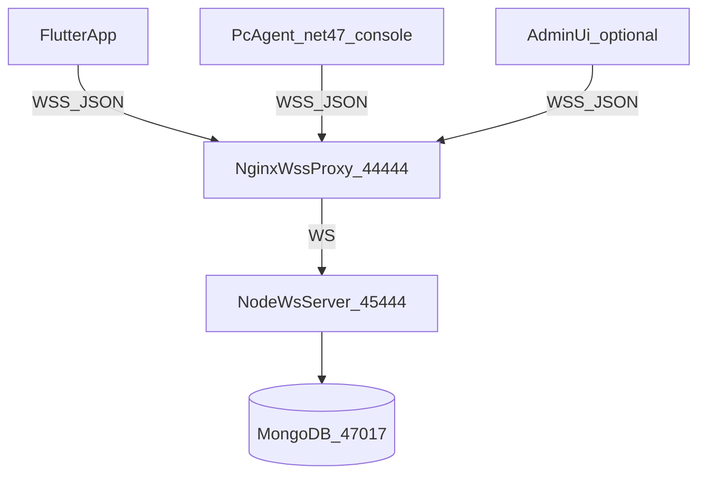
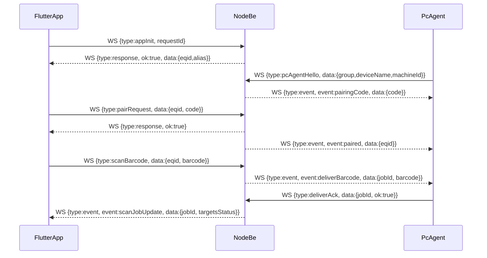

# UniScan (WS-only) BE/App/PC Agent 구현 계획

## 0) 현재 상태 요약(문서/코드 기준)
- 운영 문서에 **Nginx WSS(44444) → 내부 WS(45444)** 프록시 구조가 정의되어 있음: [uniscan/uniscan.md](/lunar/uniscan/uniscan.md)
- FE(WebSocket) 가이드는 `wss://...:44444/ws/sendReq` 형태를 사용: [uniscan/uniscan-socket-guide.md](/lunar/uniscan/uniscan-socket-guide.md)
- 앱 요구사항(그룹/디바이스 트리, 전송여부 체크, 결과 백그라운드 렌더링 등): [uniscan/uniscan-2.md](/lunar/uniscan/uniscan-2.md), [uniscan/uniscan-1st.md](/lunar/uniscan/uniscan-1st.md)
- Flutter 앱에는 이미 WebSocket 기반 공용 서비스가 있음(메시지 JSON, ping/pong):
  - [uniscan/lnuniscanfeapp/lib/services/websocket_service.dart](/lunar/uniscan/lnuniscanfeapp/lib/services/websocket_service.dart)
  - [uniscan/lnuniscanfeapp/lib/providers/websocket_provider.dart](/lunar/uniscan/lnuniscanfeapp/lib/providers/websocket_provider.dart)

## 1) 목표/제약
- **BE 클라이언트 기능 통신은 전부 WSS 메시지로만** (strict: 이미지 조회/다운로드도 WS로만)
- **PC Agent는 .NET Framework 4.7 콘솔** (쉬운 C#, 복잡한 패턴/문법 지양)
- **라우팅**: App(스캐너)에서 인식한 바코드/이미지를 선택된 PC 디바이스(복수 가능)로 전달
- **키 관리**: 디바이스는 `group + deviceName` 기준으로 관리(문서 요구)

## 2) 상위 아키텍처

## 3) WS 프로토콜(v1 제안)
- **단일 엔드포인트**: `wss://server.lunarsystem.co.kr:44444/ws/sendReq`
- **프레임 포맷(JSON)**
  - 공통: `type`, `requestId`, `clientType`(`app`|`pcAgent`|`admin`), `timestamp`, `token?`
  - 서버 응답: `type: "response"`, `requestId`, `ok`, `error?`, `data?`
  - 서버 푸시 이벤트: `type: "event"`, `event`, `data`
- **핵심 메시지 타입**
  - `appInit`: 앱 최초/재설치 시 EQID 발급(또는 재사용) + 별칭 반환
  - `appSetAlias`: EQID 별칭 변경
  - `pcAgentHello`: PC Agent 등록(그룹/디바이스명/OS/버전)
  - `pairRequest`: 앱(EQID)이 PC와 페어링(PC가 출력한 6자리 pairingCode 사용)
  - `pairList`: EQID에 연결된 PC 목록 조회(+ 상태)
  - `pairSetEnabled`: 특정 PC link ON/OFF
  - `scanBarcode`: 바코드 인식 결과 전송(서버가 선택된 PC들에 fan-out)
  - `scanImageUploadStart` + `scanImageChunk` + `scanImageUploadEnd`: strict WS-only 이미지 업로드(청크/옵션 gzip)
  - `deliverBarcode` / `deliverImage`: 서버→PCAgent 전달
  - `deliverAck`: PCAgent→서버 전달 결과(성공/실패/에러)
  - `ping` / `pong`

## 4) 데이터 모델(Mongo)
- `apps` : `{ eqid, alias, createdAt, updatedAt }`
- `pcDevices` : `{ pcId, group, deviceName, machineId, lastSeenAt, status }`
- `pairings` : `{ eqid, pcId, enabled, createdAt, updatedAt }`
- `scanJobs` : `{ jobId, eqid, kind(barcode|image), payloadMeta, targets:[{pcId, status, updatedAt, error?}], createdAt, updatedAt }`
- `rxLogs`(옵션): raw 메시지/디버깅

## 5) BE(Node.js, 순수 WS) 구현 방향
- 새 폴더(제안): [uniscan/be-ws/](/lunar/uniscan/) 하위에 `be-ws/` 추가
  - `package.json` (dependencies: `ws`, `mongodb`, `uuid` 등)
  - `src/server.js` 또는 `src/index.js`: WS 서버(45444) + 라우팅/핸들러
  - `src/protocol.js`: 메시지 스키마/검증(간단한 수동 검증)
  - `src/store/*.js`: Mongo 접근 레이어(초간단 함수형)
  - `src/connections.js`: 연결 레지스트리(클라이언트별, pcId별)
- Nginx(44444) 설정은 기존 문서를 그대로 사용(내부는 45444로 프록시): [uniscan/uniscan.md](/lunar/uniscan/uniscan.md)
- **이미지 WS-only**
  - 업로드는 청크로 받고 서버는 Mongo GridFS 또는 디스크 저장(클라이언트가 다시 WS로 `imageGetChunk` 요청 가능)
  - 크기 제한/타임아웃/청크 순서 검증 포함

## 6) App(Flutter) 구현 방향
- 기존 프로젝트를 기준으로 구현: [uniscan/lnuniscanfeapp/](/lunar/uniscan/lnuniscanfeapp)
- 화면/동작(문서 기반)
  - 앱 설치/진입 시 `appInit` 호출 → EQID 표시 + 별칭 편집
  - 하단 메뉴: 인식/결과/연동/설정(1차 간소화)
  - 연동: `pairList`로 PC 목록 표시, ON/OFF 토글, 해제(X) → `pairSetEnabled`/`pairUnpair`
  - 인식(바코드): 스캔 결과를 로컬 결과 리스트에 `pending`으로 넣고 `scanBarcode` 전송
  - 결과: 서버 이벤트(`scanJobUpdate`)를 구독해 `pending/uploading/complete` 집계 표시

## 7) PC Agent(.NET 4.7 콘솔) 구현 방향
- 신규 폴더(제안): `uniscan/pc-agent/UniScan.PcAgent/` (Visual Studio 솔루션)
- 구성
  - `appsettings.json`(또는 `config.json`): `serverUrl`, `group`, `deviceName`, `machineId`, `pairingCode` 캐시 등
  - 연결: `ClientWebSocket`으로 WSS 접속, 자동 재연결(단순 루프)
  - 등록: `pcAgentHello` 송신, 서버에서 `pairingCode` 수신 후 콘솔에 출력
  - 수신 처리: `deliverBarcode` 받으면 **키보드 입력 에뮬레이션** 수행
    - 구현은 Win32 `SendInput` P/Invoke로 단순하게(문서의 postmsg 요구를 충족하는 실사용 수준)
  - 결과: `deliverAck`로 성공/실패 및 에러 문자열 전달

## 8) 주요 플로우(mermaid)

## 9) 구현 순서(검토 후 착수)
- BE
  - 프로토콜/스키마 확정 → 연결 레지스트리 → 페어링/디바이스 목록 → 바코드 fan-out + ACK → 이미지 청크 업로드/다운로드
- App
  - `appInit` + EQID 표시/별칭 → 연동 목록/ONOFF/해제 → 인식(바코드) → 결과 화면(집계/로그)
- PC Agent
  - config/연결/재연결 → pairingCode 표시 → barcode 수신 → SendInput 타이핑 → ack

## 10) 산출물
- BE(Node): `uniscan/be-ws/` + (필요시) `uniscan/docker/docker-compose.yml`에 서비스 추가
- App(Flutter): `lnuniscanfeapp/lib/...` 내 화면/상태관리/WS 메시지 핸들러
- PC Agent(.NET 4.7): `uniscan/pc-agent/` 솔루션/프로젝트 + 빌드 산출물
