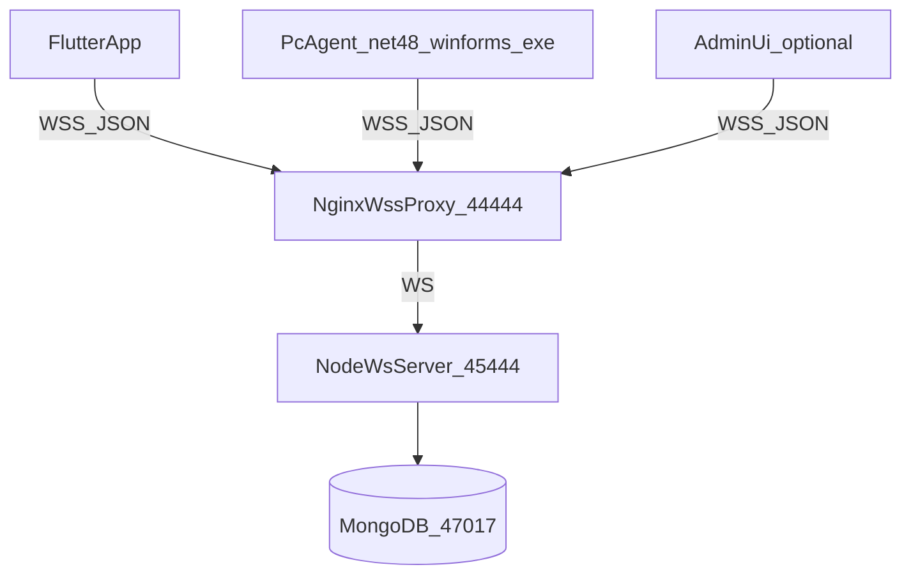
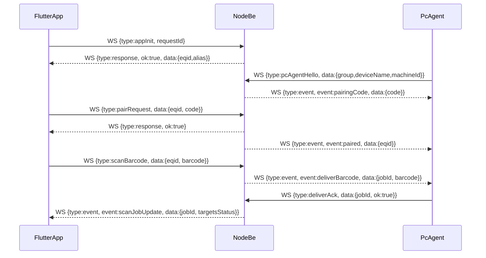

# UniScan (WS-only) BE/App/PC Agent 구현 계획

## 0) 현재 상태 요약(문서/코드 기준)
- 운영 문서에 **Nginx WSS(44444) → 내부 WS(45444)** 프록시 구조가 정의되어 있음: [uniscan/uniscan.md](/lunar/uniscan/uniscan.md)
- FE(WebSocket) 가이드는 `wss://...:44444/ws/sendReq` 형태를 사용: [uniscan/uniscan-socket-guide.md](/lunar/uniscan/uniscan-socket-guide.md)
- 앱 요구사항(그룹/디바이스 트리, 전송여부 체크, 결과 백그라운드 렌더링 등): [uniscan/uniscan-2.md](/lunar/uniscan/uniscan-2.md), [uniscan/uniscan-1st.md](/lunar/uniscan/uniscan-1st.md)
- Flutter 앱에는 이미 WebSocket 기반 공용 서비스가 있음(메시지 JSON, ping/pong):
  - [uniscan/lnuniscanfeapp/lib/services/websocket_service.dart](/lunar/uniscan/lnuniscanfeapp/lib/services/websocket_service.dart)
  - [uniscan/lnuniscanfeapp/lib/providers/websocket_provider.dart](/lunar/uniscan/lnuniscanfeapp/lib/providers/websocket_provider.dart)

## 1) 목표/제약
- **BE 클라이언트 기능 통신은 전부 WSS 메시지로만** (strict: 이미지 조회/다운로드도 WS로만)
- **PC Agent는 .NET Framework 4.8 WinForms EXE** (가벼운 UI/트레이 기반, 쉬운 C#, 복잡한 패턴/문법 지양)
- 운영 PC에 **.NET Framework 4.8 런타임 설치가 필요**(4.8은 4.7의 in-place 업데이트이므로 4.7만 설치된 환경에서는 4.8 설치 후 실행)
- **배포물은 가능한 작게**: 외부 의존성 최소화(필수 DLL만), 테마/기본 설정은 리소스 포함 또는 최초 실행 시 생성
- **라우팅**: App(스캐너)에서 인식한 바코드/이미지를 선택된 PC 디바이스(복수 가능)로 전달
- **키 관리**: 디바이스는 `group + deviceName` 기준으로 관리(문서 요구)
- **기본 데이터 흐름은 전부 비동기**: `scanBarcode` → 서버 fan-out → PC Agent 처리/ACK까지 **비동기 파이프라인**으로 설계
- **항상 큐잉(Queue) 기반**: 서버/에이전트 모두 “즉시 처리”가 아니라 **큐에 넣고 워커가 처리**(UI는 상태 렌더링만)
- **재시도 정책(기본값)**: 목적 PC 전달/처리 실패 시 **최대 5회 재시도** 후 최종 실패로 확정(백오프/타임아웃 포함)

## 2) 상위 아키텍처

## 3) WS 프로토콜(v1 제안)
- **단일 엔드포인트**: `wss://server.lunarsystem.co.kr:44444/ws/sendReq`
- **프레임 포맷(JSON)**
  - 공통: `type`, `requestId`, `clientType`(`app`|`pcAgent`|`admin`), `timestamp`, `token?`
  - 서버 응답: `type: "response"`, `requestId`, `ok`, `error?`, `data?`
  - 서버 푸시 이벤트: `type: "event"`, `event`, `data`
- **핵심 메시지 타입**
  - `appInit`: 앱 최초/재설치 시 EQID 발급(또는 재사용) + 별칭 반환
  - `appSetAlias`: EQID 별칭 변경
  - `pcAgentHello`: PC Agent 등록(그룹/디바이스명/OS/버전)
  - `pairRequest`: 앱(EQID)이 PC와 페어링(PC가 출력한 6자리 pairingCode 사용)
  - `pairList`: EQID에 연결된 PC 목록 조회(+ 상태)
  - `pairSetEnabled`: 특정 PC link ON/OFF
  - `scanBarcode`: 바코드 인식 결과 전송(서버가 선택된 PC들에 fan-out)
  - `scanImageUploadStart` + `scanImageChunk` + `scanImageUploadEnd`: strict WS-only 이미지 업로드(청크/옵션 gzip)
  - `deliverBarcode` / `deliverImage`: 서버→PCAgent 전달
  - `deliverAck`: PCAgent→서버 전달 결과(성공/실패/에러)
  - `ping` / `pong`
- **비동기/재시도/중복 처리 원칙(필수)**
  - 서버는 `scanBarcode`를 수신하면 즉시 `response(ok:true, jobId)`를 반환하고, 실제 전달은 백그라운드에서 진행
  - 서버→에이전트 `deliverBarcode`는 **at-least-once**(중복 전송 가능)로 보고, 에이전트는 `jobId` 기준 **idempotent**(중복 수신 시 재입력 방지 + ACK 재전송)
  - `deliverBarcode.data`에 `jobId`, `attempt`(1..5), `createdAt`, `eqid`, `barcode`, `suffixKey?` 포함(재전송/추적을 위해)
  - `deliverAck.data`에 `jobId`, `pcId`, `attempt`, `ok`, `error?`, `inputMethod?`, `durationMs?` 포함(관측/재시도 제어)

### 3-1) 재시도/타임아웃/백오프 정책(고정: 서버+에이전트 둘 다 5회)
- 목표: “서버 전달 성공”과 “에이전트 전역 입력 성공”을 분리해서 **둘 다 최대 5회까지** 보장하되, 중복 입력/무한 루프를 방지

| 구분 | 담당 | 재시도 대상 | 최대 시도 | 타임아웃/판정 | 백오프(권장 기본값) | 성공 기준 | 실패 확정 |
|---|---|---|---:|---|---|---|---|
| 서버 재시도 | BE | `deliverBarcode` 전송 후 ACK 미수신 | 5 | `ackTimeoutMs = 3000` (3초) 내 `deliverAck` 미수신 | 250ms → 500ms → 1000ms → 2000ms → 4000ms | `deliverAck.ok=true` 수신 | 5회 모두 ACK 미수신 또는 `ok=false` 반복 |
| 에이전트 재시도 | PC Agent | 전역 입력 주입(포커스/SendInput/대상창) 실패 | 5 | “입력 시도” 내부 실패(예: 대상창 없음/전경전환 실패/SendInput 실패) | 100ms → 200ms → 400ms → 800ms → 1600ms | 실제 입력 주입 성공 후 ACK 전송 | 5회 모두 입력 실패 후 `deliverAck.ok=false` |

- **attempt 의미(중요)**
  - `deliverBarcode.data.attempt`는 **서버 관점의 전송 attempt(1..5)** 를 의미
  - `deliverAck.data.attempt`는 **서버의 attempt 값을 그대로 에코**(추적/상태머신용)
  - 에이전트 내부 입력 재시도는 `agentAttempt(1..5)`로 따로 기록하되, ACK에는 `agentAttempt?` 필드를 추가 가능(관측용)

- **루프/중복 입력 방지 규칙**
  - 서버는 동일 `jobId+pcId+attempt` 조합으로는 중복 enqueue 하지 않음(멱등 처리)
  - 에이전트는 `jobId` 단위로 “성공 완료” 캐시를 유지하여, **이미 성공한 jobId는 재입력 금지**(서버 재전송이 와도 ACK만 재전송)
  - 서버는 `deliverAck.ok=true` 수신 즉시 해당 target을 `ack_ok`로 고정하고 추가 전송 중단

- **권장 기본값(초기 구현)**
  - `ackTimeoutMs=3000`, `serverRetryBackoffMs=[250,500,1000,2000,4000]`
  - `agentRetryBackoffMs=[100,200,400,800,1600]`
  - 키 입력 성공/실패는 “API 호출 성공 여부 + 예외/리턴코드 기반”으로 1차 판단(실제 텍스트 검증은 범용적으로 어려우므로 플랜 상 제외)

## 4) 데이터 모델(Mongo)
- `apps` : `{ eqid, alias, createdAt, updatedAt }`
- `pcDevices` : `{ pcId, group, deviceName, machineId, lastSeenAt, status }`
- `pairings` : `{ eqid, pcId, enabled, createdAt, updatedAt }`
- `scanJobs` : `{ jobId, eqid, kind(barcode|image), payloadMeta, targets:[{pcId, status, attempt, nextRetryAt?, lastAckAt?, updatedAt, error?}], createdAt, updatedAt }`
- `rxLogs`(옵션): raw 메시지/디버깅

## 5) BE(Node.js, 순수 WS) 구현 방향
- 새 폴더(제안): [uniscan/be-ws/](/lunar/uniscan/) 하위에 `be-ws/` 추가
  - `package.json` (dependencies: `ws`, `mongodb`, `uuid` 등)
  - `src/server.js` 또는 `src/index.js`: WS 서버(45444) + 라우팅/핸들러
  - `src/protocol.js`: 메시지 스키마/검증(간단한 수동 검증)
  - `src/store/*.js`: Mongo 접근 레이어(초간단 함수형)
  - `src/connections.js`: 연결 레지스트리(클라이언트별, pcId별)
- Nginx(44444) 설정은 기존 문서를 그대로 사용(내부는 45444로 프록시): [uniscan/uniscan.md](/lunar/uniscan/uniscan.md)
- **이미지 WS-only**
  - 업로드는 청크로 받고 서버는 Mongo GridFS 또는 디스크 저장(클라이언트가 다시 WS로 `imageGetChunk` 요청 가능)
  - 크기 제한/타임아웃/청크 순서 검증 포함
- **비동기 fan-out + 큐잉 + 재시도(핵심)**
  - `scanBarcode` 수신 시 `scanJobs` 생성 후 **즉시 응답**하고, fan-out은 서버 내부 작업 큐에서 처리
  - 타겟 PC별로 `targets[*].status/attempt/nextRetryAt`를 관리하며, 전송/ACK 타임아웃 시 **최대 5회까지 재전송**
    - 예: ACK 타임아웃 \(T\) (예: 2~5초) 후 재시도, 백오프(예: 250ms → 500ms → 1s → 2s → 4s) 또는 고정 간격
  - PC가 오프라인이면 “즉시 실패”가 아니라 **pending 큐에 유지**하고, 재연결 시 `nextRetryAt` 기준으로 전달 재개
  - 중복/재전송을 고려해 `jobId` + `pcId` 조합으로 상태 머신 관리(`pending → sent → ack_ok/ack_fail`)

## 6) App(Flutter) 구현 방향
- 기존 프로젝트를 기준으로 구현: [uniscan/lnuniscanfeapp/](/lunar/uniscan/lnuniscanfeapp)
- 화면/동작(문서 기반)
  - 앱 설치/진입 시 `appInit` 호출 → EQID 표시 + 별칭 편집
  - 하단 메뉴: 인식/결과/연동/설정(1차 간소화)
  - 연동: `pairList`로 PC 목록 표시, ON/OFF 토글, 해제(X) → `pairSetEnabled`/`pairUnpair`
  - 인식(바코드): 스캔 결과를 로컬 결과 리스트에 `pending`으로 넣고 `scanBarcode` 전송
  - 결과: 서버 이벤트(`scanJobUpdate`)를 구독해 `pending/uploading/complete` 집계 표시

## 7) PC Agent(.NET Framework 4.8 WinForms EXE) 구현 방향
- 목표
  - **깔끔한 UI + 작은 배포물**을 전제로, 콘솔 대신 **WinForms EXE**로 제공
  - 스킨/테마는 [Gsemac.Forms.Styles](https://github.com/gsemac/Gsemac.Forms.Styles)로 CSS 기반 적용(다크/라이트 등)
- UI 상세 플랜: `docs/plans/uniscan-pc-agent-ui.plan.md`
- 신규 폴더(제안): `uniscan/pc-agent/UniScan.PcAgent/` (Visual Studio 솔루션)
- UI/UX(최소 구성)
  - 메인 폼: 상태(연결/마지막 수신/에러), `group/deviceName`, `pairingCode` 표시, “복사” 버튼 정도의 최소 컨트롤
  - 트레이(NotifyIcon): 시작 시 트레이로 최소화 가능, 더블클릭으로 열기/닫기
  - (옵션) “윈도우 시작 시 자동 실행”은 플랜 상 후순위(필요 시 레지스트리/작업 스케줄러)
- 스킨 적용(핵심)
  - CSS 파일은 기본 제공(예: `DarkUI.css`)하고, **리소스 포함(권장)** 또는 exe 옆에 두고 로드(사용자 커스텀 허용)
  - 앱 시작 시 `StyleSheet.FromFile(...)` 또는 리소스 스트림 기반 로드 후 `UserPaintStyleApplicator`로 폼/컨트롤 전체에 적용
  - 지원 컨트롤 내에서만 구성(예: `Label`, `Button`, `TextBox`, `ListView` 등)하여 테마 품질 유지
- 통신/동작
  - 설정: `config.json`(exe 옆)로 `serverUrl`, `group`, `deviceName`, `machineId` 관리 + `pairingCode` 캐시
  - **DeviceId 안정화(중요)**:
    - PC 재설치(앱 삭제/재설치) 후에도 동일한 DeviceId가 보이도록, `machineId`는 **Windows 고유 ID(Registry `MachineGuid`)** 를 기본값으로 사용
    - 서버는 `pcAgentHello`의 `group + deviceName + machineId`를 키로 **결정론적 pcId(deviceId)** 를 생성/식별에 사용
  - 연결: `ClientWebSocket`으로 WSS 접속, 자동 재연결(백오프 단순 적용)
  - 등록: `pcAgentHello` 송신 → 서버 이벤트로 `pairingCode` 수신 → UI에 표시
  - 내부 구조(필수): **항상 큐잉 + UI는 렌더링만**
    - 네트워크 수신 스레드/핸들러는 `deliverBarcode`를 **즉시 “입력 작업 큐”에 enqueue** 후 반환(수신이 UI/입력 로직에 의해 블로킹되지 않게)
    - 입력 워커(백그라운드 Task 1개)가 큐를 순차 처리(동시 입력 방지), UI는 큐 길이/최근 처리 결과만 바인딩하여 표시
    - (옵션) 재시작 대비를 위해 `pendingQueue.json` 같은 **간단한 로컬 영속 큐**(파일)로 보강 가능(플랜 상 2차)
  - 수신 처리: `deliverBarcode` 수신 시 **전역 키 입력(실제 키보드처럼)** 수행(오토매크로 실무 패턴)
    - 기본 원칙: **윈도우 메시지(PostMessage/SendMessage)로 텍스트를 “보내는 방식”이 아니라**, OS 입력 스트림에 주입하는 **`SendInput` 기반**으로 구현
    - 대상(입력 받을 앱) 지정(옵션/권장)
      - `config.json`에 `targetWindow`(예: `processName` 또는 `windowTitleContains` 또는 `windowClass`)를 두고, 가능한 경우 해당 창을 찾아 포커스 부여 후 입력
      - 포커스/전경 전환이 막히는 케이스를 대비해 **`AttachThreadInput` + `SetForegroundWindow` + `ShowWindow`** 조합으로 안정화(필요 시 소량 지연 포함)
    - 입력 방식(우선순위)
      - 1) **스캔코드 기반 `SendInput`**: 키보드 레이아웃 영향/핫키 처리 등을 고려해 문자/키 조합을 스캔코드 중심으로 전송(실무 매크로 툴이 선호)
      - 2) **`KEYEVENTF_UNICODE`(VK_PACKET) 기반 문자 전송**: 레이아웃을 우회해 유니코드 문자를 직접 입력(단, 일부 앱/커스텀 입력 시스템에서는 호환성 이슈 가능)
      - 3) (Fallback) **클립보드 + Ctrl+V**: 특정 입력창/컨트롤에서 Unicode/스캔코드 입력이 깨질 때를 대비한 대체 경로
    - 종료 키 처리(선택)
      - 바코드 입력 후 `Enter`(또는 `Tab`) 같은 후행 키를 옵션으로 제공(`barcodeSuffixKey`)
    - 입력 재시도(요구사항 반영)
      - 목적 PC에서 **최종 전역 입력 효과가 나올 때까지** 입력 워커가 **최대 5회까지 재시도**(동일 `jobId`에 대해)
      - 재시도는 포커스 실패/SendInput 실패/대상창 미발견 등 “일시 오류”에 한정하고, 재시도 간격은 짧은 백오프 적용
      - 성공 시 즉시 `deliverAck(ok:true, attempt=...)`, 5회 실패 시 `deliverAck(ok:false, error=...)`
    - 중복/재전송 대응(idempotency)
      - 서버가 `deliverBarcode`를 재전송할 수 있으므로, 에이전트는 `jobId` 기준으로 **이미 성공 처리된 작업은 재입력하지 않고 ACK만 재전송**
    - 제약/보안(명시)
      - UAC/권한(UIPI)으로 인해 **낮은 권한 프로세스가 높은 권한(관리자) 창에 입력 주입이 실패**할 수 있음 → 필요 시 PC Agent를 관리자 권한 실행 옵션으로 설계
      - 원격 데스크톱/잠금 화면/다른 데스크톱 세션에서는 기대한 동작이 제한될 수 있음
    - 참조: `SendInput`, `AttachThreadInput`은 Windows 자동화/매크로 도구에서 흔히 쓰는 안정화 패턴(문서/레퍼런스 기반)
  - 결과: `deliverAck`로 성공/실패 및 에러 문자열 전달
- “작은 exe” 전략(현실적인 옵션)
  - 1차 목표: 불필요한 패키지/리소스 최소화 + Release 빌드 + AnyCPU
  - (옵션) 단일 EXE가 꼭 필요하면: ILRepack/Costura 등 **빌드 단계에서 병합**을 검토(우선은 “의존 DLL 최소”를 기본값으로)

## 8) 주요 플로우(mermaid)

## 9) 구현 순서(검토 후 착수)
- BE
  - 프로토콜/스키마 확정 → 연결 레지스트리 → 페어링/디바이스 목록 → 바코드 fan-out + ACK → 이미지 청크 업로드/다운로드
- App
  - `appInit` + EQID 표시/별칭 → 연동 목록/ONOFF/해제 → 인식(바코드) → 결과 화면(집계/로그)
- PC Agent
  - WinForms 셸/트레이 + 스킨 적용 → config/연결/재연결 → pairingCode 표시 → barcode 수신 → SendInput 타이핑 → ack

## 10) 산출물
- BE(Node): `uniscan/be-ws/` + (필요시) `uniscan/docker/docker-compose.yml`에 서비스 추가
- App(Flutter): `lnuniscanfeapp/lib/...` 내 화면/상태관리/WS 메시지 핸들러
- PC Agent(.NET 4.8 WinForms): `uniscan/pc-agent/` 솔루션/프로젝트 + 빌드 산출물(EXE 중심, 의존성 최소)
